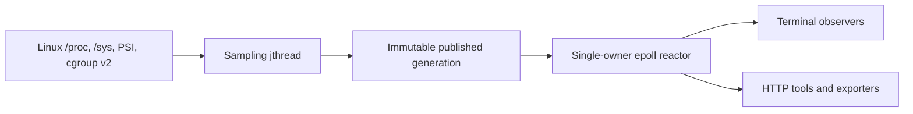

<div align="center">


### One Linux host. Many observers. No screenshot archaeology.

A C++20 telemetry server and terminal console for watching Linux systems live -
locally, over SSH, from several terminals, or through machine-readable APIs.

<p align="center">
  <a href="https://github.com/RomanSnitko/web_htop/actions/workflows/ci.yml">
    
  </a>
  <a href="https://github.com/RomanSnitko/web_htop/actions/workflows/container.yml">
    
  </a>
  <a href="https://github.com/RomanSnitko/web_htop/blob/main/LICENSE">
    
  </a>
  <a href="https://github.com/RomanSnitko/web_htop/stargazers">
    
  </a>
</p>

<p align="center">
  
  
  
  
  
  
  
  
  
</p>

[Quick start](#quick-start) · [Remote observation](#one-host-many-observers) · [Architecture](#architecture) · [HTTP API](#http-api) · [Engineering notes](#engineering-notes)

</div>

<p align="center">
  
</p>

## Not `htop` over TCP

`htop` is an excellent local process viewer. WEB HTOP solves a different problem:
**collect once on the machine being investigated, then let several independent
observers consume the same coherent telemetry stream.**

Run the server on a Linux host and connect from another terminal, another machine,
an SSH tunnel, a diagnostic script, or all of them at once. One observer can freeze
the UI or fall behind without stopping collection and without blocking the others.

| | Traditional local monitor | WEB HTOP |
|---|---|---|
| Collection | Tied to one interactive session | Dedicated server-side sampler |
| Observers | One terminal | Multiple independent TCP and HTTP consumers |
| Consistency | Values redraw as they are read | Immutable, versioned generations |
| Slow client | Usually not a concern | Isolated by bounded latest-wins delivery |
| After the incident | Terminal state is gone | JSONL recording and offline replay |
| Automation | Human-oriented output | HTTP, framed JSON and Prometheus exporter |
| Deployment | Local binary | Native, container, or Kubernetes DaemonSet |

### The 02:13 problem

One server is acting strange. Three people SSH into it. One opens a process monitor,
one runs `curl`, and the third asks for a screenshot. By the time the screenshot
arrives, the spike is gone and everyone has observed a slightly different moment.

WEB HTOP replaces that ritual with one publication stream. The operator watches the
live dashboard, a teammate connects to the same host, and a recorder keeps the
generations that would otherwise disappear. Fewer screenshots; better evidence.

## Why it is different

- **One sampler, many readers.** Collection cost does not multiply with the number
  of connected dashboards.
- **A snapshot is a real boundary.** CPU, memory, process, pressure and transport
  sections are assembled before publication; readers never receive a half-updated
  object.
- **Freshness beats backlog.** A dashboard needs the newest complete state, not
  fifty stale frames. Each session keeps one in-flight frame and one replaceable
  pending frame.
- **Pressure is first-class.** PSI answers whether work is stalled on CPU, memory,
  or I/O even when utilization alone looks harmless.
- **The monitor monitors itself.** Collector duration, snapshot age, queue usage,
  superseded frames, reconnects and timeouts are visible through diagnostics.
- **Failures have names.** `warming_up`, `partial`, `unavailable`, `stale` and a
  valid numeric zero are not collapsed into the same value.
- **Incidents are replayable.** Received generations can be recorded as JSONL and
  replayed without a running server.

## One host, many observers

The safe default is loopback-only. For remote use, keep the server on loopback and
forward both interfaces over SSH:

```bash
# On the machine being monitored
./build/server/web_htop_server
```

```bash
# On every observer machine
ssh -N \
  -L 9999:127.0.0.1:9999 \
  -L 8080:127.0.0.1:8080 \
  user@monitored-host
```

```bash
# Each observer gets an independent live console
./build/client/web_htop_client localhost 9999 8080
```

The TCP stream fans out complete snapshots to dashboards. HTTP serves point-in-time
queries and diagnostics. A slow TCP reader cannot hold a mutex needed by another
client or by the collector, and memory remains bounded by per-session and global
queue limits.

> WEB HTOP does not implement transport authentication or TLS. Keep the default
> loopback binding, use SSH, or place explicitly exposed listeners inside a trusted
> network boundary.

## See it in action

| Process Explorer | I/O telemetry |
|---|---|
|  |  |

The client has six focused workspaces:

| Key | Workspace | What it answers |
|---:|---|---|
| `1` | Overview | Is the host healthy and is telemetry fresh? |
| `2` | Processes | Which processes consume CPU and resident memory? |
| `3` | I/O | Which interfaces and block devices are active or failing? |
| `4` | Pressure | Are tasks stalled, and what does the selected cgroup see? |
| `5` | Transport | Are clients falling behind or being disconnected? |
| `6` | CPU Matrix | How is work distributed across real Linux CPU IDs? |

Use `c/m/p/t` to sort processes, `/` to filter, `j/k` to scroll, `Space` to
freeze the visible generation, and `h` for the complete key map. Freeze affects
presentation only: the network reader continues to drain the stream.

<div align="center">

</div>

## Architecture



The steady-state server uses two threads with deliberately separate ownership:

- the sampling `std::jthread` owns collectors and their previous counter values;
- the foreground reactor owns listeners, accepted sockets, session queues and
  network diagnostics.

A generation is assembled, serialized, framed and timestamped before publication.
`SharedState` release-stores a `shared_ptr<const PublishedSnapshot>`; readers acquire
one immutable version and keep it alive for the duration of their operation. The
snapshot is encoded once, not once per connected client.

The publication boundary is honest about its limits: Linux metrics are read
sequentially, not atomically by the kernel. Collection start/end timestamps and
per-section durations expose that sampling window.

## Quick start

Requirements: Linux or WSL2, CMake 3.20+, a C++20 compiler, and Python 3 for the
integration tests.

```bash
git clone https://github.com/RomanSnitko/web_htop.git
cd web_htop

cmake -S . -B build \
  -DCMAKE_BUILD_TYPE=Release \
  -DWEB_HTOP_BUILD_APPS=ON \
  -DWEB_HTOP_BUILD_TESTS=ON

cmake --build build -j"$(nproc)"
ctest --test-dir build --output-on-failure --no-tests=error
```

Start the server and client in separate terminals:

```bash
./build/server/web_htop_server
./build/client/web_htop_client localhost 9999 8080
```

The server listens on `127.0.0.1` by default. HTTP uses port `8080`; framed
telemetry uses port `9999`.

## Record and replay

Capture every received generation without interrupting the live UI:

```bash
./build/client/web_htop_client localhost 9999 8080 \
  --record incident.jsonl
```

Replay it later without a server:

```bash
./build/client/web_htop_client --replay incident.jsonl
```

Request one machine-readable snapshot:

```bash
./build/client/web_htop_client localhost 9999 8080 --once
```

## HTTP API

```bash
curl http://127.0.0.1:8080/health
curl http://127.0.0.1:8080/ready
curl http://127.0.0.1:8080/metrics
curl http://127.0.0.1:8080/processes
curl http://127.0.0.1:8080/diagnostics
curl http://127.0.0.1:8080/exporter
```

| Endpoint | Contract |
|---|---|
| `/health` | Reactor liveness; independent of collector readiness |
| `/ready` | Required collectors are healthy and the snapshot is fresh |
| `/metrics` | Complete current version-2 generation |
| `/processes` | Top-K process set with sequence and truncation metadata |
| `/diagnostics` | Sessions, queue pressure, timeouts, encoding cost and snapshot age |
| `/exporter` | Low-cardinality Prometheus metrics about WEB HTOP itself |

HTTP is intentionally small: GET-only, bounded 8 KiB headers, one request per
connection, explicit deadlines, and no request bodies or keep-alive state machine.

## Streaming protocol

The stream is not a sequence of native C++ structures. Each message is a four-byte
big-endian length followed by an owned UTF-8 JSON document, capped at 8 MiB.

Every frame is a full snapshot and carries:

- protocol version;
- message type;
- server instance ID;
- monotonically increasing generation sequence;
- collection timestamps and section status.

After reconnect, a client needs only the next frame — there is no delta-recovery
protocol. A changed instance ID identifies a server restart; a sequence gap identifies
skipped complete generations.

## Engineering notes

<details>
<summary><strong>Socket ownership and descriptor reuse</strong></summary>

All sockets are move-only `UniqueFd` values. Only the reactor closes network
descriptors. Epoll stores monotonically increasing session tokens rather than raw
file descriptors, so an event left in a returned batch cannot accidentally address
a different connection after the kernel reuses an FD number.

The reactor is level-triggered and uses explicit fairness budgets: at most 32 accepts
and 64 KiB of writes per session per turn. A `timerfd` drives deadlines; an `eventfd`
wakes the loop when a newer generation is published.

</details>

<details>
<summary><strong>Bounded backpressure</strong></summary>

A session owns one current frame with a send offset and one pending slot. Before any
byte is sent, the current frame may be replaced. After transmission begins, it must
finish intact; only the pending frame may be superseded. This preserves TCP framing
while preventing stale telemetry from building an unbounded queue.

The global queue budget is 64 MiB. Write deadlines measure lack of progress and are
not extended merely because newer telemetry exists.

</details>

<details>
<summary><strong>Lifecycle and cancellation</strong></summary>

`SIGINT` and `SIGTERM` are blocked before worker creation and consumed through
`signalfd`; asynchronous signal handlers never call into arbitrary C++ code. Both
listeners must bind before collection starts, and RAII rolls back partial startup.

Shutdown releases network sessions, requests cooperative stop, wakes pending work,
and joins the sampling thread in a defined order. Blocking socket operations cannot
hold shutdown indefinitely.

</details>

<details>
<summary><strong>Metric correctness</strong></summary>

- rates use monotonic time rather than wall-clock time;
- counter regression creates a new baseline instead of an unsigned spike;
- a first observation is `warming_up`, not a fabricated zero rate;
- processes are identified by `(pid, starttime)` to survive PID reuse;
- CPU IDs come from Linux rather than vector positions;
- `rx_kbps` and `tx_kbps` are retained wire names whose documented unit is KiB/s;
- missing, stale, unavailable and valid-zero values remain distinguishable.

Process collection intentionally scans every visible numeric `/proc` entry before
selecting the transmitted top-K set. `max_processes` bounds serialization and wire
size, not enumeration cost.

</details>

<details>
<summary><strong>Defensive parsing</strong></summary>

The JSON implementation owns its strings and limits input bytes, nesting depth,
node count and object keys. It rejects duplicate keys, invalid UTF-8, malformed
escapes, non-finite numbers and unsupported protocol versions. Remote process names
are reduced to printable terminal cells before rendering; ANSI control sequences
are emitted only by the renderer.

</details>

## Containers and Kubernetes

The repository includes a multi-stage server image and Kubernetes DaemonSet manifests
for amd64 and arm64 nodes:

```bash
docker buildx build --platform linux/amd64,linux/arm64 .
kubectl apply -k packaging/k8s
```

The runtime image uses a non-root UID, a read-only root filesystem and dropped Linux
capabilities. Host `/proc` and `/sys` mounts are read-only. Broader process access is
an explicit opt-in overlay, not the default.

Host PID visibility and host filesystem mounts remain sensitive privileges even
without `privileged: true`. Read [the deployment notes](docs/container.md) before
running WEB HTOP in a cluster.

## Optional scheduler latency profiler

`tools/scheduler` contains a separate libbpf/CO-RE profiler for run-queue latency:
the time runnable work spends waiting before it reaches a CPU. It is opt-in and is
never loaded by the ordinary telemetry server. Kernel BTF and BPF permissions are
required; failure of the experimental profiler does not affect normal monitoring.

## Tests and measurements

The test suite exercises more than successful parsing:

- every split point in framed TCP input;
- partial writes and several frames arriving together;
- stalled HTTP and TCP readers;
- counter resets, collector warm-up and PID reuse;
- descriptor reclamation and partial-startup rollback;
- shutdown while sessions have pending output;
- concurrent immutable publication;
- JSON ownership and parser limits.

GCC and Clang builds, ASan, UBSan, TSan and short fuzz runs are defined in CI.

Performance claims should come with the environment and raw data. The included
benchmark records request latency, collection time, server CPU, peak RSS, payload
size and reactor counters against synthetic procfs populations:

```bash
python3 scripts/benchmark.py \
  --server ./build/server/web_htop_server \
  --processes 5000 \
  --clients 10 \
  --requests 200 \
  --output benchmark-5000.json
```

## Project layout

```text
client/       terminal UI, replay and network client
server/       Linux collection, publication and epoll runtime
common/       owned JSON, models, protocol and RAII utilities
tests/        deterministic, integration and fuzz checks
tools/        optional scheduler profiler
packaging/    service and Kubernetes deployment files
scripts/      run, benchmark and validation helpers
docs/         contracts, architecture and operational notes
```

## Documentation

- [Architecture and ownership](docs/architecture.md)
- [Metric definitions](docs/metrics.md)
- [HTTP contract](docs/http_api.md)
- [Streaming protocol](docs/protocol.md)
- [Tests and measurements](docs/testing.md)
- [Design decisions](docs/decisions.md)
- [Container and Kubernetes deployment](docs/container.md)

## License

WEB HTOP is available under the [MIT License](LICENSE).

<div align="center">

Built by [Roman Snitko](https://github.com/RomanSnitko).

</div>
