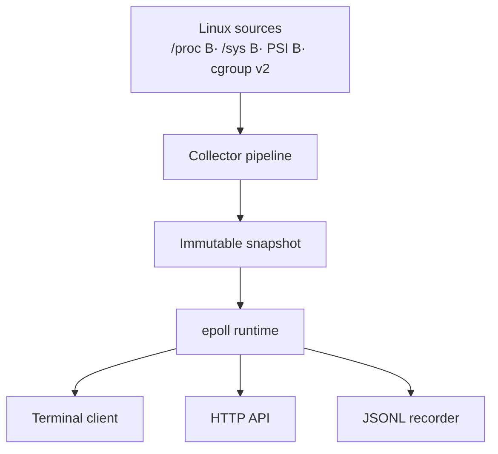

<div align="center">


# WEB HTOP

**A real-time Linux telemetry engine built for the cases where a pretty CPU bar is not enough.**

[](https://en.cppreference.com/w/cpp/20)
[](https://kernel.org/)
[](https://cmake.org/)
[](https://man7.org/linux/man-pages/man7/epoll.7.html)

WEB HTOP collects live Linux metrics, publishes coherent snapshots, exposes them through HTTP and framed TCP, and renders them in an interactive terminal console. It is designed around explicit ownership, bounded resource usage, graceful shutdown, and metrics whose meaning can be explained.

[Quick start](#quick-start) В· [Why WEB HTOP](#why-web-htop) В· [Architecture](#architecture) В· [HTTP API](#http-api) В· [Engineering notes](#engineering-notes)

</div>

---

## Why WEB HTOP?

Most terminal monitors answer one question: what is using my CPU right now?

WEB HTOP is built for the next set of questions:

- Is the machine busy, or are workloads stalled by CPU, memory, or I/O pressure?
- Which cgroup is consuming the resources?
- Are network counters healthy, and how quickly is traffic moving?
- Is telemetry still fresh, or is a collector unavailable or warming up?
- Can one slow client stall every other observer?
- Can the server stop cleanly while connections and collectors are active?

The result is closer to a compact telemetry service than an `htop` clone: one collector pipeline, multiple read-only consumers, a terminal dashboard, and machine-readable APIs.

## Highlights

| Area | What WEB HTOP provides |
|---|---|
| **System telemetry** | CPU, per-core load, memory, swap, disks, network interfaces, uptime, load average, and processes |
| **Linux pressure** | PSI signals for CPU, memory, and I/O, plus cgroup v2 resource visibility |
| **Process identity** | Samples keyed by PID and process start time, avoiding false deltas after PID reuse |
| **Coherent reads** | Immutable snapshots published as a single version to terminal, TCP, and HTTP readers |
| **Network runtime** | Linux `epoll`, framed TCP telemetry, HTTP endpoints, deadlines, and bounded client queues |
| **Slow-client isolation** | Latest-snapshot delivery prevents an observer that stopped reading from blocking everyone else |
| **Diagnostics** | Collector freshness, transport counters, session state, and explicit warm-up/unavailable states |
| **Offline analysis** | JSONL recording and replay for debugging telemetry without a live server |


## Quick Start

WEB HTOP targets Linux and uses CMake with a C++20 compiler.

```bash
git clone https://github.com/RomanSnitko/web_htop.git
cd web_htop

cmake -S . -B build \
  -DWEB_HTOP_BUILD_APPS=ON \
  -DWEB_HTOP_BUILD_TESTS=ON

cmake --build build -j"$(nproc)"
ctest --test-dir build --output-on-failure
```

Start the telemetry server:

```bash
./build/server/web_htop_server
```

Open the terminal console in another shell:

```bash
./build/client/web_htop_client localhost 9999 8080
```

Or use the helper scripts:

```bash
bash scripts/run_server.sh
bash scripts/run_client.sh localhost 9999 8080
```

## One Console, Several Views

The client separates the system into focused screens instead of compressing every number into one table:

1. **System** — host health, CPU, memory, disk, network, and freshness.
2. **Processes** — sortable process telemetry with interactive filtering.
3. **CPU Matrix** — per-core utilization using the real Linux CPU identifiers.
4. **Pressure** — CPU, memory, and I/O PSI signals.
5. **Cgroups** — resource consumption and limits from cgroup v2.
6. **Transport** — active sessions, queued output, dropped snapshots, and network health.

The UI keeps receiving telemetry while a view is frozen for inspection. Recorded JSONL sessions can be replayed later, which makes intermittent performance problems easier to study and demonstrations reproducible.

## HTTP API

The server exposes a small read-only API on port `8080` by default.

```bash
# Liveness and telemetry readiness
curl http://127.0.0.1:8080/health

# Current system snapshot
curl http://127.0.0.1:8080/metrics

# Current process sample
curl http://127.0.0.1:8080/processes
```

Example health response:

```json
{
  "status": "ready",
  "sequence": 1842,
  "snapshot_age_ms": 37,
  "collectors": {
    "cpu": "ready",
    "memory": "ready",
    "network": "ready",
    "processes": "ready"
  }
}
```

The TCP stream carries length-prefixed JSON snapshots. A frame includes a protocol version, server instance identifier, and monotonically increasing sequence number so reconnects and restarts can be detected explicitly.

## Architecture



Collectors build the next snapshot away from readers. Publication swaps in one complete immutable version, so a consumer never observes a half-updated system state. The network layer consumes that published state; it does not run collectors while holding transport locks.

## Engineering Notes

### Resource ownership is visible in the types

File descriptors are managed by a move-only RAII owner. Connection state and descriptor ownership are separate concerns: a failed session may be dead, but its descriptor still has exactly one owner responsible for closing it.

Background work uses `std::jthread` and cooperative cancellation through `std::stop_token`. Shutdown stops accepting clients, wakes pending work, closes sessions, and joins workers in a defined order.

### Slow clients do not become global backpressure

Every client has a bounded output state. Dashboard delivery follows a **latest wins** policy: a partially transmitted frame is completed, one newest snapshot is retained, and obsolete pending snapshots may be replaced. This preserves TCP framing while keeping memory bounded.

The server tracks dropped snapshots and clients that make no progress, making overload visible instead of hiding it behind growing queues.

### Metrics have explicit semantics

- Durations and rates use monotonic time rather than wall-clock time.
- A first sample is `warming_up`; it is not silently reported as a zero rate.
- Counter regressions establish a new baseline instead of producing an unsigned spike.
- Network rates and byte units are named consistently.
- Process CPU history uses `(pid, starttime)` rather than PID alone.
- Missing, stale, unavailable, and valid-zero values remain distinct.

### Read-only by design

WEB HTOP observes the machine; it does not terminate processes or change cgroup limits. The default workflow is suitable for local diagnosis, remote observation through a protected tunnel, testing, and recorded-session analysis.

## Verification

Run the complete test suite:

```bash
ctest --test-dir build --output-on-failure
```

The test strategy covers more than parsers and happy paths:

- partial TCP reads and writes;
- multiple frames received together;
- stalled HTTP and TCP clients;
- counter resets and collector warm-up;
- PID reuse;
- shutdown while network operations are active;
- JSON ownership and validation boundaries.

Sanitizer builds are recommended while changing concurrency or ownership code:

```bash
cmake -S . -B build-asan \
  -DWEB_HTOP_BUILD_TESTS=ON \
  -DCMAKE_CXX_FLAGS="-fsanitize=address,undefined -fno-omit-frame-pointer"

cmake --build build-asan -j"$(nproc)"
ctest --test-dir build-asan --output-on-failure
```

## Experimental: Scheduler Latency

An optional CO-RE/eBPF profiler can extend utilization metrics with scheduler latency: the time runnable work spends waiting before it is placed on a CPU. It is intentionally separate from the core runtime, which continues to work without eBPF support or elevated privileges.

Kernel capabilities, BTF availability, and permissions vary by system; treat this module as experimental and validate it on the target kernel.

## Project Layout

```text
client/       interactive terminal console
server/       collection, snapshot publication, and network runtime
common/       models, framing, JSON, and shared utilities
tests/        unit, parser, lifecycle, and socket-level tests
scripts/      build and run helpers
docs/         architecture and operational notes
```

## Documentation

- [Build and run guide](docs/build_run.md)
- [Architecture notes](docs/architecture.md)
- [Branch and module plan](docs/description_branches.md)

## Roadmap

- [ ] Reproducible latency and throughput benchmarks
- [ ] Long-running soak tests with slow and reconnecting clients
- [ ] Additional cgroup v2 controller metrics
- [ ] Prometheus compatibility and dashboard examples
- [ ] Kernel-version matrix for the optional eBPF profiler

## Author

Designed and developed by **Roman Snitko**.

If WEB HTOP helped you understand a difficult Linux performance problem, consider starring the repository or opening an issue with a reproducible workload.
